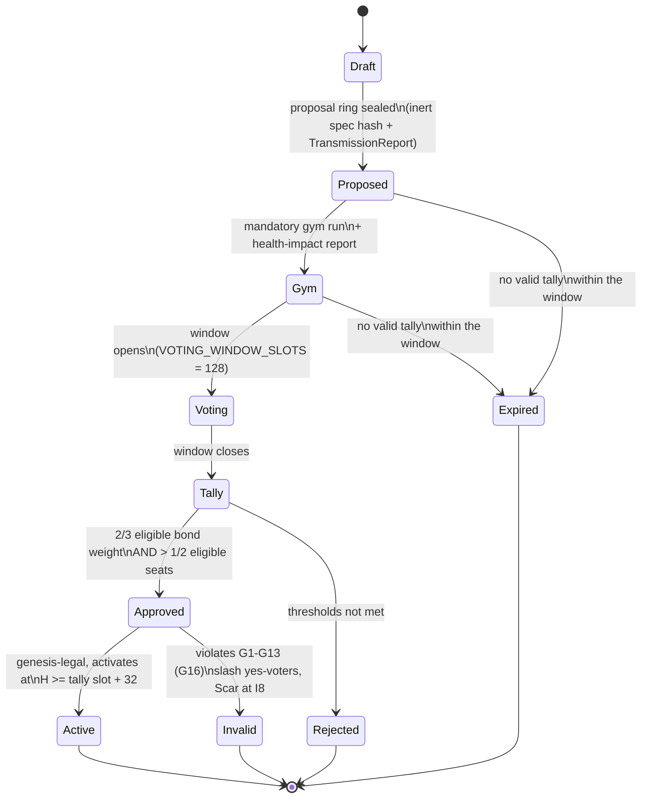

# COUNCIL.md — Council Charter and the Proposal State Machine (K14)

The Council is Chronarch's bonded human stewardship layer: the set of active Hearth stakers whose positions meet the bond, pin, and liveness floors, and the **only** body that can ratify a MAJOR change. This document is the charter (kernel module `K14_council_charter_proposal_machine`): who is eligible to sit, what counts as MINOR versus MAJOR, the single legal proposal state machine from draft to height-activated change, the exact tally rule, and the slashing that backs every ballot. Council members are not hidden admins and not an AI (G11); Chronarch drafts but never enacts (G15); and no key anywhere bypasses Proposal + Ballot + height activation (G17).

Status: v0 draft — sim/MVP values are FROZEN-MVP; changing them post-genesis is a MAJOR change (G14).

> **INVARIANT** — verbatim from `SLOGANS["change"]`, identical to G14 and the ninth covenant line, encoded here and in [GENESIS.md](GENESIS.md):
>
> **"Major change is a proposal ring plus a slashing-backed vote, not an AI rewrite and not an admin key."**

---

## 1. Charter numbers

All values verbatim from the kernel constants (K14 and friends). Integers only; ratios in basis points (bps, 1/10000).

| Constant | Value | Meaning |
|---|---|---|
| `MIN_COUNCIL_BOND_CHRONONS` | `1000 * CHRONONS_PER_CHRONOS` = 1000 Chronos (10^15 chronons) | FROZEN-MVP. Minimum Hearth **bond_leg** for a Council seat. |
| `MIN_PINSET_SIZE` | `4` | At least the kernel objects pinned. |
| `MAX_CHALLENGE_GAP_SLOTS` | `64` | Mandatory gym cadence — a seat must have a pin-challenge pass within this gap (prestress, never slack). |
| `VOTING_WINDOW_SLOTS` | `128` | FROZEN-MVP. Voting window length. |
| `ACTIVATION_DELAY_SLOTS` | `32` | FROZEN-MVP. Approved changes activate at height H ≥ tally slot + this delay. |
| `COUNCIL_APPROVE_WEIGHT_NUM` / `COUNCIL_APPROVE_WEIGHT_DEN` | `2` / `3` | Yes bond weight must be ≥ 2/3 of **eligible** bond weight. |
| Seat threshold | strict majority | Yes seats > 1/2 of **eligible** seats. |
| `COMMUNITY_PROPOSAL_DEPOSIT_CHRONONS` | `100 * CHRONONS_PER_CHRONOS` = 100 Chronos (10^14 chronons) | FROZEN-MVP. Deposit for a community-drafted proposal. |
| `UNBOND_DELAY_SLOTS` | `32` | FROZEN-MVP (sim) — so slashes land before exit ([HEARTH.md](HEARTH.md)). |
| `HEARTH_BOND_LEG_BPS` | `5000` | FROZEN-MVP. The slashable security-bond leg of the Hearth lock ([HEARTH.md](HEARTH.md)). |
| `REWARD_ROUTER_BPS["council_ops_share"]` | `300` bps of each slot's issuance | Pays published tallies/reports, **never a yes-vote** ([TOKEN.md](TOKEN.md)). |

Changing the council thresholds or membership floors in this table (approval weights, seat majority, voting window, activation delay, bond/pinset/cadence floors) is MAJOR class **M6** (`council_thresholds_or_membership_floors`); changing `UNBOND_DELAY_SLOTS`, the Hearth leg split, or any reward-router row (including `council_ops_share`) is **M4** (`issuance_reward_router_hearth_split_unbond_delay`). Either way: Proposal + Ballot only (G14).

---

## 2. Membership: eligible seats

A **seat** is a Hearth position ([HEARTH.md](HEARTH.md)), not a person-registry entry and not an appointment. A seat is **eligible** at a given slot iff **all** of the following hold:

1. **Bond floor** — the position's `bond_leg` (the slashable leg, `HEARTH_BOND_LEG_BPS = 5000` of the lock) holds at least `MIN_COUNCIL_BOND_CHRONONS` = 1000 Chronos.
2. **No unbond in progress** — an exit through the `UNBOND_DELAY_SLOTS = 32` queue suspends eligibility, so slashes land before exit.
3. **Recent pin-challenge pass** — a passing pin/retrieval challenge within the last `MAX_CHALLENGE_GAP_SLOTS = 64` slots, with a pinset of at least `MIN_PINSET_SIZE = 4` objects. Prestress is latent and maintained, never slack (G18; [NERVOUS.md](NERVOUS.md)).
4. **Not slashed** — no unresolved slash against the position.
5. **Not quarantined** — no active Immune quarantine on the identity ([GYM.md](GYM.md)).

Eligibility is measured, sealed, and public — it feeds the `council_liveness` component of the epoch HealthVector ([GENESIS.md](GENESIS.md)) and interface **I10** (`council_liveness_illegal_ratification`, [NERVOUS.md](NERVOUS.md)).

**What Council members are NOT:** not hidden admins (G11 — "Hidden admin is a bug"), not an AI, not an oligarchy holding an override key (G17). They are bonded, challenged, slashable stewards. The snapshot slot at which the eligible set is fixed for a given voting window is TBD (requires Proposal + Ballot).

---

## 3. MINOR changes — no Council vote required

Chronarch/Cambium may enact these autonomously, but **every enactment is still sealed as rings** on the Timechain (G1) — autonomy never means silence. Verbatim from `MINOR_CLASSES`:

| MINOR class | Gloss |
|---|---|
| `new_gym_cases_existing_classes` | New gym cases inside already-approved target classes (never a new class — that is M5). |
| `hibernate_unused_faculty` | Put an unused faculty to sleep (`faculty_hibernate` ring); reactivation on the protocol path is M3. |
| `local_hippocampus_rebuild` | Rebuild local hippocampus indexes; commitments, not embeddings, are consensus (G9). |
| `pinset_advertisement` | Advertise the node's pinned CAS objects. |
| `epoch_health_vector` | Publish the epoch HealthVector as a `health` ring. |
| `primitive_composed_sense_passing_holdout` | Auto-compose kernel primitives into a new sense that passes holdout (G4 — primitives may auto-compose; authored code stays inert). |

Anything not on this list that touches kernel, covenant, issuance, Hearth split, gym scope, or protocol faculty activation is MAJOR by G15.

---

## 4. MAJOR changes M1..M9 — Proposal + Ballot ONLY

Verbatim from `MAJOR_CLASSES` (G14/K14). Anything here has exactly one path: the state machine in Section 5.

| Id | Class (verbatim) | Notes |
|---|---|---|
| M1 | `covenant_or_genesis_param_change` | **Also a hard fork** (G7). Covers every FROZEN-MVP constant. |
| M2 | `kernel_module_upgrade` | Any K1..K18 module ([GENESIS.md](GENESIS.md)). |
| M3 | `activate_authored_faculty_on_protocol_path` | Authored code is inert until activation (G4); only live-registry hashes run (G3). |
| M4 | `issuance_reward_router_hearth_split_unbond_delay` | Issuance schedule, reward router bps, Hearth leg split, unbond delay ([TOKEN.md](TOKEN.md), [HEARTH.md](HEARTH.md)). |
| M5 | `add_or_widen_gym_target_class` | **Can never widen beyond the Chronarch target classes** (`chronarch_fixture`, `chronarch_sim`, `chronarch_testnet`): G12 binds even the Council, so a proposal targeting any third-party system is an **illegal proposal** — invalid and slashable under G16, no matter the vote. |
| M6 | `council_thresholds_or_membership_floors` | The numbers in Section 1. |
| M7 | `retire_scar` | Approval alone removes nothing: it **still needs a forget-scar ring** sealed on top after review — scars cannot be pruned (G5). |
| M8 | `external_asset_adapter` | Any bridge/adapter to external assets. |
| M9 | `emergency_lockdown_beyond_automatic_immune_lock` | Lockdown beyond what the Immune system already does automatically. |

---

## 5. The proposal state machine — the only legal path

### 5.1 Draft

A proposal may be drafted by:

- **Chronarch** — via Cambium's `cambium_propose_modality` (`DRAFT_PROPOSAL` opcode), which is **inert by construction**: it produces a proposal body and can never enact (G15).
- **A councilor** — any currently eligible seat (Section 2).
- **The community** — anyone, with a deposit of `COMMUNITY_PROPOSAL_DEPOSIT_CHRONONS` = 100 Chronos escrowed against gym-fraud (Section 7).

### 5.2 Proposal ring

The draft is sealed as a `proposal` ring containing:

- the **inert spec hash** — the hash of the exact change payload; the payload itself executes nothing (G4), and
- a **TransmissionReport** — the predicted load transmission of the change across interfaces I1..I10 (`PREDICT_TRANSMISSION` / `transmission_sense`; [NERVOUS.md](NERVOUS.md)). Predict, then test: a failed prediction falsifies the health model and is itself a scar (G18).

### 5.3 Mandatory gym + health-impact report

Before any vote, the proposal must be exercised in the Immune Gym against **Chronarch targets only** (G12; [GYM.md](GYM.md)), and a health-impact report against the HealthVector components must be sealed. No gym evidence, no vote — a proposal that never produces a valid gym + health-impact record cannot reach tally and **expires**.

### 5.4 Voting window and Ballot rings

The voting window is `VOTING_WINDOW_SLOTS = 128` slots. Each eligible seat may seal **one** `ballot` ring: seat identity, proposal hash, and vote. Duplicate or forged ballots are slashable (Section 7).

### 5.5 Tally

Ballots are counted (`council_tally_modality`, `TALLY_BALLOTS` — counting only; validity is ruled by core) and the outcome — **approve**, **reject**, or **expire** — is sealed as a result ring (`council` ring type) referencing the proposal and every ballot. Publishing the tally/report is paid from `council_ops_share` (300 bps) — the payment is for the published record, **never for a yes-vote**.

### 5.6 Activation — or invalidation

- **Approved AND genesis-legal** → the change activates at height **H ≥ tally slot + `ACTIVATION_DELAY_SLOTS` = 32**. Never earlier, never retroactively (G1, G17). For M1 this activation is also the hard-fork point (G7).
- **Approved but illegal under G16** (it violates any of G1–G13) → the proposal is **invalid**, every yes-voting seat's `bond_leg` is **slashed**, and a **Scar is sealed at interface I8** (`covenant_drift_illegal_upgrade`); the restriction also registers at I10 (`council_liveness_illegal_ratification`). A unanimous yes changes nothing: the Council cannot vote the constitution away.
- **Any transaction claiming an admin/helm/founder override** — anything on the K18 reject list (`admin_key`, `founder_key`, `helm_override`, `ai_self_enact`) or matching a forbidden key token — is **rejected at admission, scarred at I8, and slashed if signed by a bonded identity** (G17; [GENESIS.md](GENESIS.md)). The gym cases `fake_admin_key_tx` and `fake_helm_override_tx` exist precisely to prove these must reject ([GYM.md](GYM.md), [THREATS.md](THREATS.md)).

---

## 6. Tally rule (exact)

A proposal is **approved** iff **both** hold, measured against **ELIGIBLE** totals (not against votes cast):

1. **yes bond weight ≥ 2/3 of eligible bond weight** (`COUNCIL_APPROVE_WEIGHT_NUM = 2`, `COUNCIL_APPROVE_WEIGHT_DEN = 3`), **AND**
2. **yes seats > 1/2 of eligible seats** (strict majority of seats).

Because both denominators are the eligible totals, **this IS the turnout floor**: an abstention or a no-show counts against the proposal, never for it. There is no separate quorum knob to game, and a low-turnout window can only make approval harder.

---

## 7. Slash backing — every ballot has skin

| Behavior | Consequence | Law |
|---|---|---|
| **Yes on an illegal proposal** (violates G1–G13) | `bond_leg` slashed; Scar at I8. | G16 |
| **No-show while prestress/HEALTH is critical** | **Eligibility demotion** — the seat drops out of the eligible set until floors are re-met. Demotion is a sealed, visible event (I10), **not silent control**: no hidden operator mutes a seat. | G18 |
| **Forged or double ballots** | Slash. One seat, one ballot per proposal. | G1, G2 |
| **Community deposit, gym-fraud** | `COMMUNITY_PROPOSAL_DEPOSIT_CHRONONS` slashed if the proposal's mandatory gym or health-impact evidence is fabricated or tampered. Refund policy otherwise: TBD (requires Proposal + Ballot). | G6, G12 |

Slashing hits the Hearth `bond_leg` and can never bend G1–G7 (G13): slash math destroys bond, it never edits history or flips a judgment.

---

## 8. What the Council cannot do

The Council stewards; it does not rule. It **cannot**:

- **Edit past rings** — history is append-only; correction is a new ring or scar (G1).
- **Flip Challenge results** — judgment is not for sale, to anyone, including the Council (G2). The gym case `council_bribe_to_pass_challenge` **must fail** ([GYM.md](GYM.md)).
- **Un-pin evidence** — scars and their pinned evidence cannot be pruned; only a reviewed forget-scar ring may be sealed on top (G5, M7).
- **Mint Chronos outside issuance** — `PREMINE_CHRONONS = 0`; no premine, no founder allocation, no admin mint ([TOKEN.md](TOKEN.md)).
- **Disable the Immune system** — automatic immune response is not subject to a vote; only M9 lockdown *beyond* it is even proposable.
- **Expand the gym to third-party systems** — G12 binds even the Council (Section 4, M5). "Attack yourself; do not attack strangers."
- **Act via an admin key** — no such key exists to act with (G17, K18 reject list).

---

## 9. Bonded weight is backing, not a bribe market

Vote weight is **bonded, slashable Chronos** — the Hearth `bond_leg` standing behind a ballot. Chronos is blood, not conscience (G2): it **cannot buy a judgment flip** — not a Challenge outcome, not a PoQ attestation, not a Ballot's validity. All it can do is **stand behind a vote and be destroyed when the vote is illegal**. Three kernel facts enforce this:

- The salience overlay clamp (`SALIENCE_CLAMP_MIN_BPS = 2500`, `SALIENCE_CLAMP_MAX_BPS = 40000`) applies to retrieval **ranking only** — never to Challenge outcomes or Ballot validity (G2).
- `council_ops_share` (300 bps) pays published tallies/reports, never a yes-vote.
- G16 makes the purchased outcome worthless: an illegal approval is void and the buyer's bond burns.

"Tampering is detectable, expensive, incomplete, and metabolized into a scar."

---

## 10. Cross-references

- [GENESIS.md](GENESIS.md) — Genesis Law G1..G18, covenant seed, Ring 0, reject list, testing bar (T2, T3, T4, T10).
- [HEARTH.md](HEARTH.md) — the one-lock/two-leg position behind every seat; slash and unbond mechanics.
- [NERVOUS.md](NERVOUS.md) — interfaces I8 and I10; prestress measurement; TransmissionReport semantics.
- [GYM.md](GYM.md) — mandatory proposal gym runs; `council_bribe_to_pass_challenge`, `illegal_upgrade_attempt`, `fake_admin_key_tx`, `fake_helm_override_tx`.
- [TOKEN.md](TOKEN.md) — issuance, reward router, `council_ops_share`.
- [THREATS.md](THREATS.md) — capture, bribe, and illegal-ratification threat analyses.
- [BOOTSTRAP.md](BOOTSTRAP.md), [ARCHITECTURE.md](ARCHITECTURE.md) — where the Council machinery boots and lives.

"Chronarch proposes. The Timechain remembers. The tensegrity feels. The Council stewards. Chronos is blood, not conscience."
